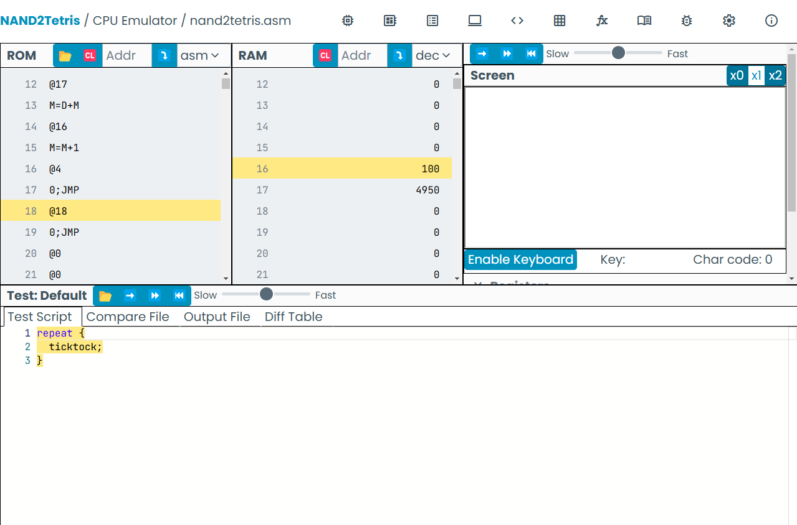

# Investigación

## **CPU**
Es el componente principal de un sistema informático que **interpreta y ejecuta instrucciones**, **procesa datos** y **controla las operaciones del sistema**.

## **ALU (Unidad Aritmética Lógica)**
Subunidad de la CPU que realiza **operaciones aritméticas y lógicas**.

## **REGISTROS**
Unidades de **almacenamiento rápido** dentro de la CPU que almacenan temporalmente **datos, instrucciones o direcciones**.

### **Propósito General**
Almacena temporalmente **datos durante cualquier operación**.

### Registros de Propósito Específico
- **Program Counter (PC)**: Dirección de la próxima instrucción a ejecutar.
- **Stack Pointer (SP)**: Apunta al último elemento en la pila.
- **Base Pointer (BP)**: Señala la base de la pila en una función.
- **Accumulator (AC)**: Almacena resultados de operaciones.
- **Instruction Register (IR)**: Contiene la instrucción actual.

## **Unidad de Control**
Dirige y **sincroniza las operaciones** de la CPU, enviando señales a los componentes.

## **Bus de Datos**
Transporta **información** entre la CPU, memoria y otros dispositivos.

## **Bus de Dirección**
Transporta las **ubicaciones de memoria** a leer o escribir.

## **Memoria**

### **RAM (Memoria Volátil)**
Almacena temporalmente datos e instrucciones durante la ejecución.

### **ROM (Memoria No Volátil)**
Contiene datos permanentes como el **firmware**.

> La **ROM** ha evolucionado a tecnologías como **EEPROM** o **FLASH MEMORY**.

## **Opcode**
Especifica la **operación** que la CPU debe realizar, como **sumar**, **comparar** o **mover datos**.

## Simulación en Digital

Cada uno de los componentes interactúa entre sí para simular un computador de **16 bits**. La tarea principal de esta simulación es ejecutar un **programa previamente cargado**, que gestiona la interacción de la CPU, la ROM y la memoria para realizar tareas específicas.

El sistema está compuesto por las siguientes partes clave: **CPU**, **ROM** y **Memoria**.

- La **CPU** es responsable de **solicitar datos** desde la **ROM**, donde se encuentra el programa cargado. Su función es **decodificar las instrucciones** contenidas en el programa y procesarlas de acuerdo a lo que se requiere. Después, la CPU actualiza los valores en la memoria para reflejar los cambios y preparar la salida.
  
- La **Memoria** se utiliza para almacenar tanto los datos del programa como la información que se actualiza a lo largo de la ejecución. En ella también se encuentra el componente **HackDisplay**, que gestiona la salida visual en la pantalla.

- La **ROM** almacena el **programa** que se ejecuta en el computador simulado. Este programa contiene todas las instrucciones necesarias para que la CPU pueda procesar y llevar a cabo las tareas requeridas por el sistema.

El componente **HackDisplay** se encuentra en la memoria y es el responsable de mostrar la salida visual del programa en una pantalla de **512 px x 256 px**. Esta pantalla refleja lo que ocurre en el sistema, mostrando los cambios en tiempo real según las interacciones del usuario (por ejemplo, cuando se presionan las teclas `1`, `2`, `3` o `4`).

Ésta es una simulación básica de un computador de **16 bits** y refleja la **interacción** entre los componentes clave de una arquitectura de computadora.
---

## Simulación en Digital
La simulación emula un **computador de 16 bits** que ejecuta un **programa cargado** en la CPU, ROM y memoria.

- **CPU**: Solicita datos desde **ROM**, los decodifica y los procesa. 
- **Memoria**: Almacena datos y actualiza la información en la pantalla.
- **ROM**: Contiene el programa ejecutado en la CPU.

**HackDisplay**: Se encuentra en la memoria, mostrando la salida visual en una pantalla de **512 px x 256 px**.

---

### **¿Qué es un programa y dónde se almacena?**
Un **programa** es un conjunto de instrucciones que realiza tareas específicas. Se almacena en la **ROM** o almacenamiento secundario y luego se carga en la **RAM**.

### **¿Dónde se almacena un comentario en un programa?**
Los **comentarios** (como `//variable tipo contador`) no se almacenan en la memoria de datos. Están en el archivo de código fuente y son ignorados durante la ejecución.

### **¿Dónde se almacena una variable?**
Las **variables** se almacenan en la **RAM**. Las **locales** en la pila y las **globales** en el segmento de datos.

---

## Proceso Fetch-Decode-Execute
El ciclo de la **CPU** para ejecutar un programa:

1. **Fetch (Buscar)**: La CPU busca la instrucción en la memoria.
2. **Decode (Decodificar)**: La CPU interpreta la instrucción.
3. **Execute (Ejecutar)**: La CPU realiza la acción solicitada.

Este ciclo se repite hasta que el programa termine.

---

## Tipos de Instrucciones del Procesador

1. **Aritméticas y Lógicas**: Operaciones matemáticas o lógicas. Ej: `ADD R1, R2`.
2. **Movimiento de Datos**: Mueve datos entre registros o memoria. Ej: `MOV R1, R2`.
3. **Control de Flujo**: Modifica la secuencia de ejecución. Ej: `JMP 200`.
4. **Entrada/Salida (E/S)**: Interacción con dispositivos externos. Ej: `IN R1`.
5. **Comparación**: Compara valores y actualiza registros. Ej: `CMP R1, R2`.

---

## **Instrucciones Tipo A**
- **Características**: Almacenan los 15 bits menos significativos de la instrucción en el **REGISTRO A**.
- **Ejemplo**: `0x4000` se almacena en **REGISTRO A**.

---

## **Instrucciones Tipo C**
- **Características**: Son más complejas, realizan varias operaciones y modifican el flujo del programa.
- **Formato**: `destino = operación; salto`.
  - **Destino**: Registro donde se guarda el resultado (Ej. `D` o `A`).
  - **Operación**: Acción a realizar (Ej. `A`, `D`, `M`).
  - **Salto**: Controla el flujo de ejecución.

- **Ejemplo**: `0xEC10` es equivalente a `D=A`.

---

## Simulación NAND2TETRIS
La simulación muestra cómo el **programa en código `.asm`** interactúa con la **CPU, registros y memoria**. Un contador en la posición `16` y un acumulador en la `17` cuentan hasta **100**.

